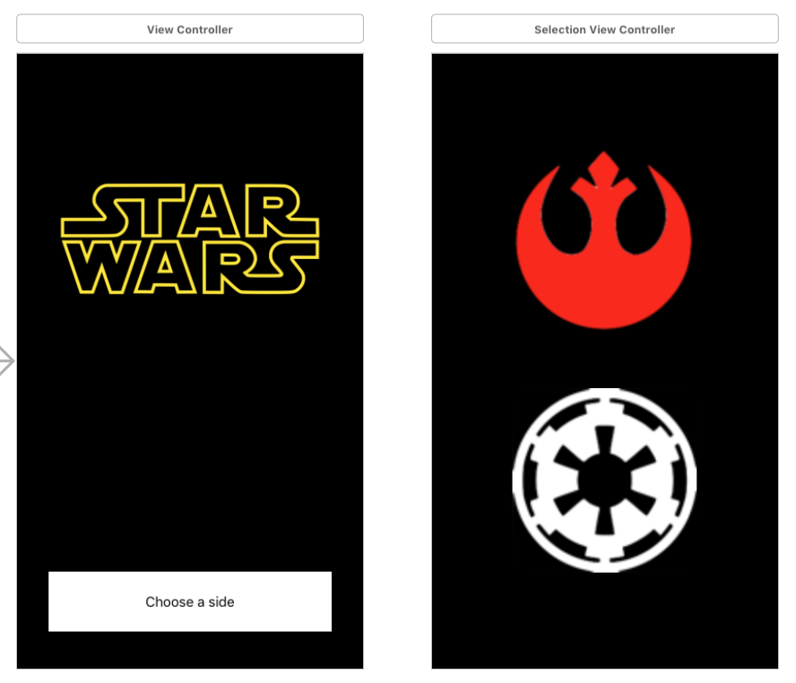

## Delegate-Protocol Example

	

This example shows how to create a Delegate-Protocol relation between two seperate views. It's important to note, delegates are used for 1-1 relationships between views. If you wish to use a 1-many relationships, consider using Observers/Notifications to update the various views properly.
